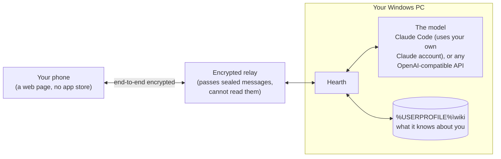
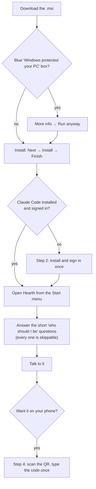
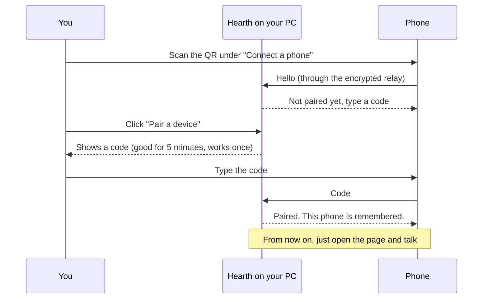

# Hearth for Windows

A personal AI agent that runs on your own PC, and reaches your phone from
anywhere — with no router configuration, no account, and no data stored on
anyone else's infrastructure.

Install the app. Talk to your agent. Scan a QR code and take it with you.

**This is the downloads repo.** Hearth's source lives in a private repo; the
Windows installer is free to grab, because a personal agent you cannot download
is not one you own. **Hearth is Windows-only for now.**

- **Setting it up yourself?** Follow steps 1–4 below. About ten minutes.
- **An AI assistant setting it up for someone?** Read
  [For AI assistants](#for-ai-assistants) first. It has the exact commands,
  a check for each step, and the steps only the person can do.

---

## How it fits together



Your PC does the thinking and keeps the memory. The phone is only a window onto
it. Nothing is forwarded into your network: Hearth dials out.

---

## Download

You don't need to clone anything or build anything — Hearth is a ready-to-run
installer. Just download it and double-click.

**[⬇ Download the latest Hearth for Windows or Mac](https://github.com/mmorris35/hearth-release/releases/latest)**

**Windows:** on that page, under **Assets**, click **`Hearth_0.3.0_x64_en-US.msi`**. (Mac: see [On a Mac](#on-a-mac) below.)

> ### ⚠️ Read this first — the one thing that stops most people
> When you open the installer, Windows shows a **blue "Windows protected your
> PC"** box. **This is not a virus warning, and Hearth is not broken.** Windows
> shows it for *any* app that hasn't paid for a code-signing certificate yet. The
> button to continue is hidden: click **More info**, then **Run anyway**.

### On a Mac

On the same page, under **Assets**:

- **Apple Silicon** (M1 or newer; Apple menu → About This Mac says "Chip: Apple M…"): **`Hearth_0.3.0_aarch64.dmg`**
- **Intel** (About This Mac says "Processor: Intel"): **`Hearth_0.3.0_x64.dmg`**

Open the `.dmg` and drag **Hearth** into **Applications**.

> ### ⚠️ The first open is blocked, on purpose
> Hearth isn't signed with an Apple developer certificate yet, so macOS refuses
> to open it the first time. Double-click it once and dismiss the warning. Then
> open **System Settings → Privacy & Security**, scroll down to the message about
> Hearth, and click **Open Anyway**. After that it opens normally.
>
> If macOS instead says Hearth **"is damaged and can't be opened"**, it isn't
> damaged. That's the same missing signature, reported differently. Open
> **Terminal** and run this once, then open Hearth again:
> ```
> xattr -dr com.apple.quarantine /Applications/Hearth.app
> ```

**Giving it a brain on a Mac** (instead of the PowerShell steps in step 2
below): open **Terminal** (press ⌘-Space, type `Terminal`), paste this and press
Enter, and let it finish:
```
curl -fsSL https://claude.ai/install.sh | bash
```
Then run `~/.local/bin/claude`, sign in with your Claude account, and close it.
Hearth finds it there by itself.

Apart from that, everything below is written for Windows but works the same on a
Mac. The tray icon is in the **menu bar** (top right), and your wiki is at
`~/wiki/`.

---

## Setting it up



### 1. Install it

Double-click the `.msi` you downloaded.

1. On the blue **"Windows protected your PC"** screen, click **More info**.
2. Click **Run anyway**.
3. Click through the installer (**Next → Install → Finish**). If Windows asks
   whether to allow the app to make changes, click **Yes**.

Hearth is now in your Start menu.

### 2. Give it a brain (one time)

Hearth needs an AI model to think with. The simplest option uses **Claude Code**
with your existing Claude account:

1. Open **PowerShell**: click Start, type `PowerShell`, press Enter. Use the
   plain blue **PowerShell** window (or **Windows Terminal**) — **not** the one
   labelled *PowerShell ISE*. ISE is a script editor and can't run Claude's
   sign-in.
2. Copy-paste this line and press Enter, and let it finish:
   ```powershell
   irm https://claude.ai/install.ps1 | iex
   ```
3. **Close PowerShell and open a new PowerShell window** (so it sees the new
   install). Then sign in by running Claude Code directly — copy-paste this and
   press Enter:
   ```powershell
   & "$env:USERPROFILE\.local\bin\claude.exe"
   ```
   Claude Code opens and asks you to sign in — **sign in with your Claude
   account**, then close it. That's it.

> **Why the full path?** Typing just `claude` may work, but the line above always
> works even if PATH isn't set or a leftover shim gets in the way. **If `claude`
> gave you `command not found` or a `/bin/bash` error, that's expected on some
> machines — use the full-path line above.** And you do **not** need the bare
> `claude` command for Hearth: Hearth finds `claude.exe` in `.local\bin` by
> itself. You only need to sign in once.

> **Prefer an API key instead?** Open Hearth → **Settings** → **Model** → set **Provider** to
> *OpenAI-compatible endpoint*, fill in **Base URL**, **API key** and **Model**,
> then **Save and restart service**. That works with OpenAI, OpenRouter, a local
> Ollama and anything else that speaks the OpenAI API. (Then you can skip Claude
> Code entirely.)

### 3. Meet your agent

Open **Hearth** from the Start menu. On first run it **asks who it should be** —
a few short questions (what to call you, what to call it, how it should talk,
what it's for), and every one is skippable. Answer them and you're immediately
talking to your own assistant, which remembers you between sessions.

The window opens on **Chat**. Everything else (your phone, folders, the model,
the identity questions) is on the **Settings** tab. The top of the window tells
you whether the model is connected and signed in; if anything's off, it shows
the exact fix.

### 4. (Optional) Talk to it from your phone

The QR code under **Settings → Connect a phone** is your PC's address. It never changes and
it is safe to share with your own phone. The **pairing code** is what actually
lets a phone in, and it works once.



1. On your phone, point the camera at the QR code under **Settings → Connect a
   phone** and open the link. It says the phone isn't paired yet. (If you only just
   opened Hearth, give it about 15 seconds first; until then the phone can't
   find it yet and says it couldn't catch up.)
2. In Hearth, click **Pair a device**. A code appears.
3. Type that code into your phone. Done.

Your phone now talks to the same agent, from anywhere — no app store, no account.
Add the page to your home screen for an app-like icon.

**Notifications.** Once the page is on your home screen, tap **Desktops ▾ →
Turn on notifications** and allow them. (iPhone: iOS 18.4 or newer, and the PC
on 0.3.0 or newer.) Then, if you ask something and leave the app before the
answer comes, the answer arrives as a notification; tap it to open Hearth.
Answers you watched arrive don't notify twice. Your PC sends these itself,
encrypted: Apple or Google delivers them without being able to read them.

**Lost your phone?** Open
Hearth → **Settings** → **Paired devices** → **Revoke**, and it can no longer
reach your agent.

---

## Everyday use

- **Just type.** Ask it anything; it answers from your PC.
- **It remembers you.** What it learns about you lives in plain text in your
  wiki at `%USERPROFILE%\wiki\` (start with `me\profile.md`). Open and edit it
  any time. If you also use Claude Code on this PC, it can share the same wiki.
- **It runs in the background.** Closing the window hides Hearth to the tray (by
  the clock, bottom-right). To fully stop it, right-click the tray icon →
  **Quit Hearth**.

### Let it read (and edit) your folders

By default Hearth can read only its own files and your wiki. To add a folder:

1. **Settings → Folders → Browse…**, pick the folder (or type a path and click
   **Add**).
2. Tick **Phone may edit** if you want it to be able to create and change files
   there when you're talking to it from your phone. (At the PC it can always
   edit.)
3. Click **Save folders and restart service**.

Hearth refuses a folder that doesn't exist and tells you which one, so a typo
can't quietly leave it blind.

### What your phone is allowed to do

From the phone, Hearth can always talk and read the folders you listed, and it
can change files in any folder ticked **Phone may edit**. Anything else that
needs a yes from someone at the PC (running commands, changing other files,
searching the web) is refused, because nobody is at the PC to say yes.

To let your phone do everything this computer can, tick **Let my phone do
anything this computer can** under **Settings → Model** (Claude Code only), then
**Save and restart service**. Only paired phones can reach Hearth, so the risk is a lost,
unlocked phone. Revoke it under **Paired devices**.

### Updating

1. **Quit Hearth first:** right-click the Hearth icon in the tray (by the
   clock) → **Quit Hearth**. Closing the window is not enough; it keeps running
   in the tray, and a running Hearth can make the installer hang at
   *"Validating install"*.
2. Download the newest `.msi` from the
   [latest release](https://github.com/mmorris35/hearth-release/releases/latest)
   and double-click it.

It replaces the installed Hearth in place: no uninstall first, and your
conversations, pairing and memory are kept. Then reload the page on your phone.

**iPhone users: the PC must be on 0.2.2 or newer.** Older versions can't reach
an iPhone at all (Safari refuses the relay address they publish).

### Uninstalling

**Settings → Apps → Installed apps** (on Windows 10: **Apps & features**) →
**Hearth** → **Uninstall**. Your data is left in
place, in case you come back: delete `%LOCALAPPDATA%\hearth` (the agent) and
`%USERPROFILE%\wiki` (what it knows about you) to remove everything.

---

## If something looks wrong

| What you see | What to do |
|---|---|
| "Windows protected your PC" | Expected (unsigned). **More info → Run anyway**. |
| Hearth says Claude Code is missing or not signed in | Redo **step 2**; the window shows the exact command. |
| `claude` gives "command not found" or a `/bin/bash` error | A leftover shim is hijacking the name. Sign in with the full path instead: `& "$env:USERPROFILE\.local\bin\claude.exe"`. You don't need the bare `claude` command — Hearth finds `claude.exe` on its own. |
| `claude.exe` says "Input must be provided ... `--print`" | You're in **PowerShell ISE**, which can't run an interactive sign-in. Close it, open **Windows Terminal** or a plain **PowerShell** window, and run the full-path line again. |
| **"Risky action blocked … Attack surface reduction"** naming `hearth-app.exe` (usually a work or school PC) | Your organisation's security policy blocks new, unsigned apps that few people run yet. You can't click past it. Ask whoever manages the PC to add an exclusion for `C:\Program Files\Hearth\hearth-app.exe`, or use a personal PC. |
| Installer stuck on **"Validating install"** | The old Hearth is still running. Click **Cancel**; if a *files in use* box appears, choose to close the applications and it continues. Otherwise cancel, right-click the tray icon → **Quit Hearth** (end any leftover Hearth in Task Manager), and run the `.msi` again. |
| Replies come back blank | You're on 0.2.0. Update to the latest (see **Updating**). From 0.2.2 on, a blank answer from the model shows as an error that says where to look. |
| The agent won't answer | Check the top of the window — it says whether the model is reachable and signed in. |
| Phone says "couldn't catch up — is your desktop running?" | Hearth isn't running on the PC (check the tray), or the PC is off or asleep. If you only just started Hearth, wait 15 seconds and reload. **On an iPhone, also check the PC is on 0.2.2 or newer.** |
| Phone says "This app is out of date … Reload to update" | The phone and PC are on different versions. Reload the page; if it persists, update Hearth on the PC. |
| Phone won't pair | Codes last five minutes and work once. Click **New code** in Hearth and type the fresh one. |

---

## For AI assistants

You are helping a person install Hearth on **Windows**. Do **not** clone or
build anything; install the published `.msi`. Run each step in a normal
PowerShell window (not PowerShell ISE), check it, and only then move on. Some
steps need the person; tell them exactly what to click.

| Step | You run | It worked when | Needs the person |
|---|---|---|---|
| 1. Download | `$a = (Invoke-RestMethod https://api.github.com/repos/mmorris35/hearth-release/releases/latest).assets \| Where-Object name -like '*.msi'`<br/>`Invoke-WebRequest $a.browser_download_url -OutFile "$env:TEMP\$($a.name)"` | `Test-Path "$env:TEMP\$($a.name)"` is `True` | — |
| 2. Install | If Hearth is already installed, have the person quit it from the tray first (see **Updating**).<br/>`Start-Process msiexec -Wait -ArgumentList "/i ""$env:TEMP\$($a.name)"""` | `Get-StartApps Hearth` lists Hearth | Clicking **Yes** on the Windows permission prompt, and **More info → Run anyway** if SmartScreen appears |
| 3. Claude Code | `irm https://claude.ai/install.ps1 \| iex` | `Test-Path "$env:USERPROFILE\.local\bin\claude.exe"` is `True` | — |
| 4. Sign in | Ask the person to open a **new** PowerShell and run `& "$env:USERPROFILE\.local\bin\claude.exe"` | `& "$env:USERPROFILE\.local\bin\claude.exe" auth status` shows `"loggedIn": true` | **All of it.** The sign-in is interactive and happens in their browser. |
| 5. First run | Ask the person to open **Hearth** from the Start menu | `Test-Path "$env:LOCALAPPDATA\hearth\config.json"` is `True` | Answering (or skipping) the first-run questions |
| 6. Smoke test | Ask the person to type *hello* in the window | `Get-Content "$env:LOCALAPPDATA\hearth\memory\conversation.log.md" -Tail 6` shows an assistant line **with text under it** | Typing the message |
| 7. Phone (optional) | — | The phone shows the chat instead of "not paired" | **All of it:** scanning the QR, clicking **Pair a device**, typing the code |

Rules:

- **Never ask for, read or store the person's Claude credentials or API keys.**
  Claude Code keeps its own sign-in; Hearth never touches it.
- **Folders:** add only folders the person names, through **Settings →
  Folders** (preferred). If you must edit `%LOCALAPPDATA%\hearth\config.json`
  directly, quit Hearth from the tray first: `"dirs"` lists the readable
  folders and `"edit_dirs"` the subset the phone may edit, with backslashes
  doubled.
- **Leave "Let my phone do anything this computer can" off** unless the person
  asks for it, after telling them what it allows.
- If step 6 shows an assistant line with nothing under it, Hearth is older than
  0.2.2: update it (repeat steps 1–2) and test again.

---

## What you're trusting

Most privacy tools ask you to trust a policy. This one is arranged so there is
less to trust.

| The question | The answer |
|---|---|
| Can you read my conversations? | No. There is no server of ours in the path. We could not read them if we wanted to. |
| Where does my agent's memory live? | On your own disk: what it knows about you in `%USERPROFILE%\wiki`, and its own settings and transcript in `%LOCALAPPDATA%\hearth`. It is never uploaded. |
| Do I need an account? | No. No email, no password, no magic link. A paired device key is the credential. |
| Do I have to configure my router? | No. The desktop dials out. Nothing is ever forwarded in. |
| Who can reach my agent? | Only devices you have paired. Revoke one and it is gone immediately. |
| What if I lose my phone? | Revoke that device key. Nothing on the phone is a credential once revoked. |
| Which model does it use? | Yours. Claude through your own Claude Code sign-in, or any OpenAI-compatible model, local or cloud. Swap it whenever you like. |
| What happens if this project stops? | Your install keeps working. It is your binary, your disk, your model. No license check, no server to switch off. |

## Why this exists

Over the past year I built a fleet of agents for myself. It got to the point
where I authored complete apps and frameworks from behind the backstop at a
Little League game, with nothing but a phone.

Then I tried to give that to my friends and family, and I couldn't — not because
they lacked the ideas, but because the setup is brutal: servers, tokens, port
forwarding, a machine that stays up, a dozen decisions nobody should have to make
to talk to their own computer.

That's what Hearth is. Install the app, and the thing I have is the thing you
have. The requirement was that it work for anyone, without router edits and
without needing to know what a relay is. Privacy is a side effect of meeting that
requirement honestly: the architecture that is easiest to hand to someone you
love is also the one with nothing in the middle.

## What this repo does *not* contain

No source code, no keys, no telemetry. Only the built Windows installer and
release notes. If a release asset is all you can see here, that is by design.

## Why the name

The hearth was the part of a house that kept working whether or not anyone was
watching it, and everything else arranged itself around it.
